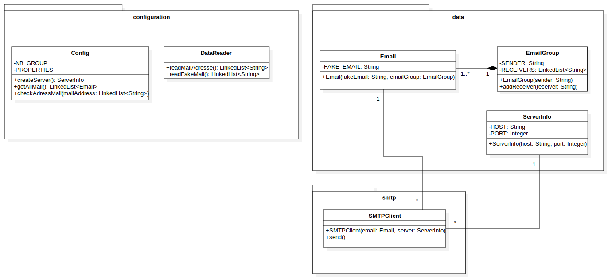
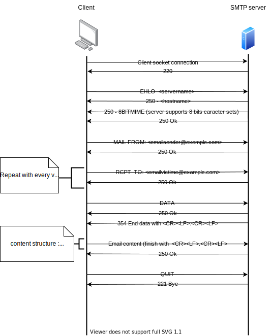

# Rapport SMPT - DAI

##### Laetitia Guidetti et Cédric Centeno

## Description du projet

Ce projet a pour but de réaliser un client SMTP (le protocole de communication utilisé pour transférer des emails vers les serveurs de messagerie électronique, 
détails : https://www.rfc-editor.org/rfc/rfc5321.html). Ce client utilise l'API socket pour communiquer avec un serveur SMTP.
L'application permet d'envoyer des blagues par email à une liste de victimes. L'application forme un ou plusieurs groupes de victimes, 
chaque groupe aura une victime qui sera désignée comme l'envoyeur et les autres comme des destinataires. Un email sera ensuite 
envoyé à chaque groupe, l'email fera croire que l'envoyeur est la victime désignée.
Les informations permettant la communication avec le serveur, les faux emails et les victimes sont configurables.

## Instructions pour lancer le faux serveur SMTP

## MockMock 
L'application utilise actuellement un Mock SMTP Server : MockMock (https://github.com/HEIGVD-Course-DAI/MockMock).
Ce serveur permet de tester le fonctionnement de notre client. Les emails qui atteignent le serveur ne sont pas envoyés 
aux clients. Il permet de voir à quoi les emails fournis au serveur via le client ressemble via une interface Web.
Par conséquent, il s'agit uniquement d'un serveur de test et non d'envoi. 

## MockMock sur Docker
### Dépendances
Les programmes suivants doivent être installés :
- Java avec un jdk >= 11
- Docker
- maven
- (telnet pour tester manuellement la communication avec le serveur Mock)

### Outils mis à disposition
Dans le dossier docker se trouvent les outils nécessaires à l'installation du 
server mock avec Docker. Ce dossier contient :
- **MockMock-1.4.1-SNAPSHOT.one-jar.jar** : Exécutable du serveur mock. Il est 
  possible de générer soi-même cet exécutable en suivant les instructions suivantes :
  - Cloner le repo suivant : https://github.com/DominiqueComte/MockMock.git
  - Ouvrir le terminal à la source du projet, exécuter la commande ```mvn clean package```. 
    On peut ensuite trouver l'exécutable souhaité (MockMock-1.4.1-SNAPSHOT. one-jar.jar) 
    dans le dossier target du projet.
- **Dockerfile** : Commandes pour construire l'image docker avec la configuration 
  souhaitée
- **build-image.sh** : Construit l'image (spécifié par Dockerfile) en local
- **run-container.sh** : Exécute un container depuis l'image créée par build-image.

### Etapes pour lancer le serveur
Dans le dossier docker, il faut en premier exécuter :```build-image.sh``` pour 
créer l'image, puis ```run-container.sh``` pour lancer un container.

Ces commandes terminées, le container contenant le serveur Mock tourne maintenant en 
background.
Ses ports 25 (pour smtp) et 8282 (pour l'interface web) sont ouverts.

#### Commande pour se connecter manuellement au serveur SMTP
```telnet localhost 25```.

#### Consulter les emails reçus par le serveur 
Se connecter sur un navigateur à cette page : ```localhost:8282```.

## Configuration et lancement du client

Plusieurs options sont paramétrables, tous les fichiers de configuration se situent dans le dossier SMTP/src/main/resources.

Le fichier config.properties contient les paramètres globaux et ceux du serveur. Chaque paramètre y est stocké comme une paire composée 
d'une clé (le nom du paramètre) et de sa valeur. Par conséquent, seule la partie située après le = est à modifier.\
La ligne host permet d'indiquer l'adresse IP du serveur.\
La ligne port permet d'indiquer le port sur lequel écoute le serveur.\
La ligne nbGroupe permet d'indiquer le nombre de groupes de victimes que l'on souhaite créer.\
Exemple de contenu conforme :

> host=localhost\
> port=25\
> nbGroupe=5

Le fichier address.txt permet d'indiquer toutes les victimes. Il doit n'y avoir qu'une adresse par ligne. Si une adresse 
est invalide, cela provoquera une erreur lors de l'exécution du programme. Il doit au minimum avoir 3 fois plus d'adresses 
que le nombre de groupes souhaité (minimum 1 envoyeur et 2 destinataires). Les groupes sont formés de manière aléatoire.\
Exemple de contenu conforme :

> mario.amos@heig-vd.ch\
> tim.ernst@heig-vd.ch\
> cedric.centeno@heig-vd.ch\
> michael.gogniat@heig-vd.ch

Le fichier fakeEmail.txt permet de rentrer les faux emails. Chaque email doit être séparé par le charactère "#" qui doit 
être seul sur une ligne. Chaque début d'email doit commencer par "Subject:" puis l'objet de l'email, laissez ensuite une ligne 
vide, puis écriviez le contenu du mail. Le contenu du mail est encodé en UTF-8. Il peut y avoir plus ou moins de faux mails que de 
nombre de groupes (si plus : certains textes ne sont pas envoyés, si moins : certains textes sont envoyés plusieurs fois).
Le faux mail envoyé à un groupe est aléatoire.\
Exemple de contenu conforme :

> Subject: Mon Dieu
>
> Bonjour cher camarade,
>
> J'ai découvert\
> Suite du mail ...\
> #\
> Subject: LA VERITE
> 
> Contenu du mail ...

### Etapes pour lancer le client
- Ouvrir un terminal dans le dossier ```SMTP``` du projet. Dans ce dossier ce 
trouve le fichier ```pom.xml``` qui contient les informations du projet et les 
détails de configuration utilisé par Maven pour construire l'exécutable du programme.
- Entrer la commande ```mvn clean package```. Cette commande va générer 
  l'exécutable du projet dans un dossier target.
- Pour lancer le programme, entrer la commande
```java -jar target/SMTP-1.0-SNAPSHOT-standalone.jar```.

## Implémentation
### Class Diagram


Le code est réparti en 3 paquetages : data, configuration et smpt.\
Le premier **data** est chargé de stocker via diverses classes toutes les informations obtenues via le paquetage configuration.

- La classe **ServerInfo** qui permet de stocker les informations permettant de communiquer avec le serveur SMTP
- La classe **EmailGroup** qui permet de stocker les groupes d'adresses. Elle y a toujours un envoyeur et au minimum 2 destinataires
- La classe **Email** qui permet de stocker toutes les informations d'un email. Elle contient un objet EmailGroup et le contenu de l'email à envoyer

Le deuxième **configuration** permet de lire les ressources et de vérifier la conformité de toutes les informations.

- La classe **DataReader** permet de lire les fichiers txt selon le format voulu (address.txt et fakeEmail.txt)
- La classe **Config** récupère les informations de config.properties et permet de créer un objet ServerInfo. Elle utilise  
DataReader pour récupérer les adresse emails qu'elle place dans des objets EmailGroupe. Elle vérifie que chaque adresse soit valide et
que le nombre total d'adresses soit suffisant pour le nombre de groupes spécifié. Elle récupère via cette classe également les contenus des emails 
ce qui lui permet de créer les objets Email

Le dernier **smt**p utilise les objets créés plutôt pour établir une communication avec le serveur SMTP et de lui transmettre les faux mails.

- La classe **SMTPClient** est une implémentation d'un client SMPT. Elle permet d'établir une connexion avec le serveur 
grâce au contenu d'un objet ServerInfo et d'envoyer un email grâce à un objet Email.

### Exemple communication SMTP client-serveur


Le serveur renvoie 250 lorsqu'il a bien reçu un message du client. Si le serveur
renvoie un message d'erreur, le client met fin à la communication (QUIT).

Le message 354 ... envoyé par le serveur lors de la bonne reception du message
client DATA indique la syntaxe permettant de déterminer la fin du contenu de l'email.